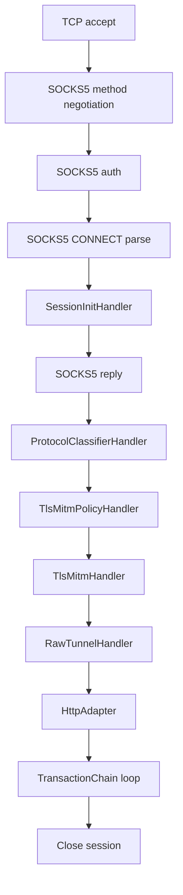
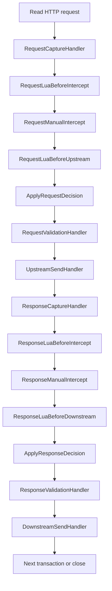
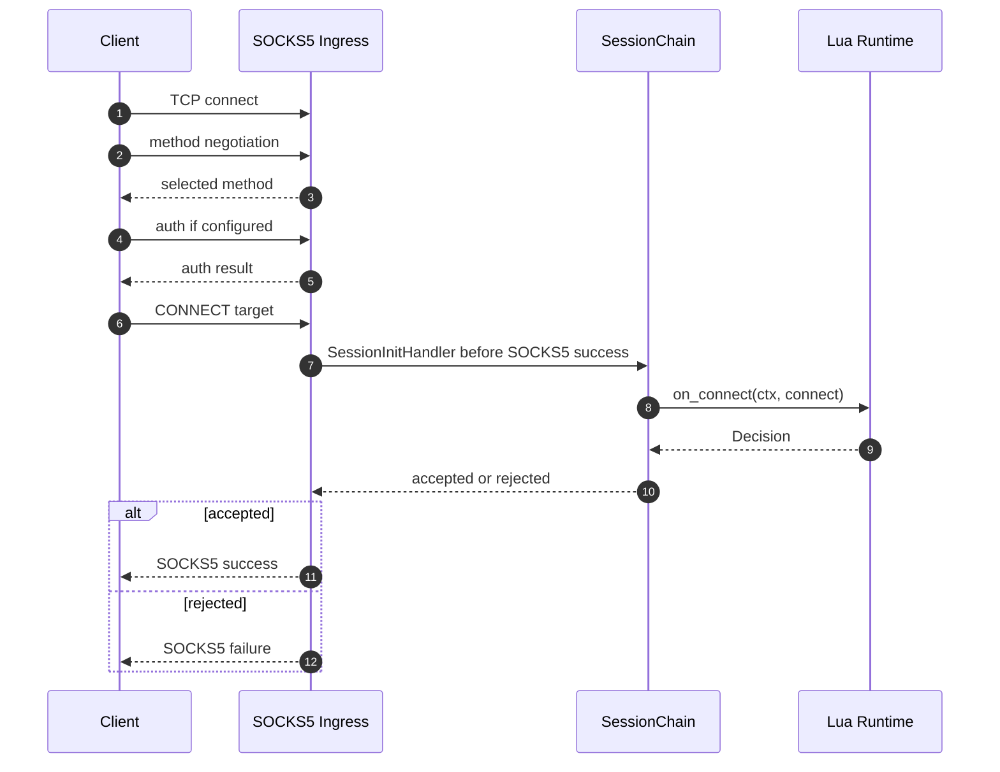
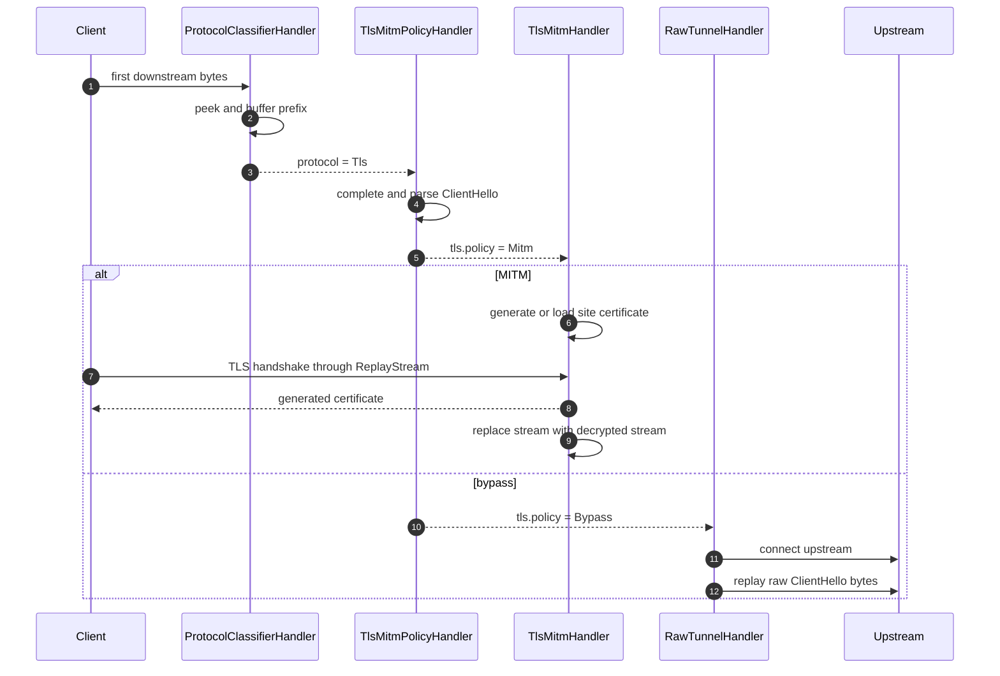
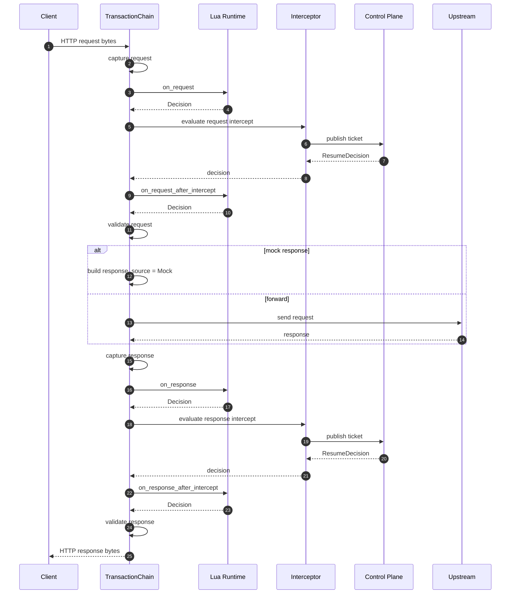
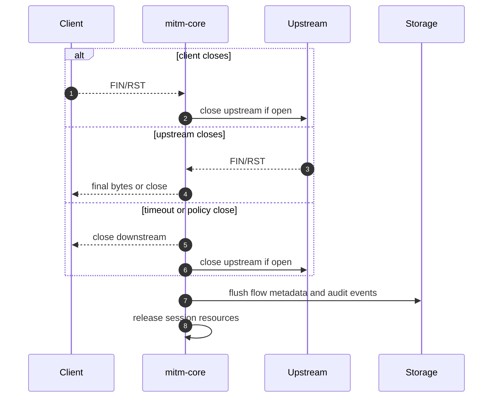

# mitm-core 架构设计提案

## 背景与目标

本仓库用于承载一个跨平台 HTTP/HTTPS 流量调试工具。Rust core 仅作为协议处理核心存在，Windows 接入、Android 接入、证书安装、系统代理设置、UI 与自动化控制能力均放在 core 外部模块中。

`mitm-core` 的首要目标是接收 SOCKS5 输入，完成 TCP、HTTP、HTTPS 流量捕获，并提供类似 Burp Suite 的请求和响应拦截、编辑、透传能力。Lua 脚本作为自动化处理入口，参与连接、TLS 决策、请求和响应阶段的处理。

核心数据流如下：

```text
SOCKS5 ingress -> SessionChain -> TransactionChain -> upstream
```

`SessionChain` 处理连接级事项，包括 SOCKS5 会话初始化、协议识别、TLS MITM 决策、TLS 握手、Raw TCP 透传。`TransactionChain` 处理 HTTP 消息级事项，包括请求捕获、请求 Lua、请求人工拦截、请求校验、upstream 发送、响应捕获、响应 Lua、响应人工拦截、响应校验和 downstream 发送。

## 目标与非目标

### Core 目标

1. 接收 SOCKS5 `CONNECT` 输入并维护 Session 生命周期。
2. 识别 HTTP/1.1、TLS ClientHello、Raw TCP、h2c prior knowledge。
3. 对明文 HTTP/1.1 与 TLS MITM 后的 HTTP/1.1 执行捕获、修改、暂停、恢复、丢弃、mock response。
4. 提供 Lua hook 的受限执行环境，并把 Lua 返回值转换为结构化 `Decision`。
5. 提供事件、拦截票据、配置、证书导出、关闭控制等 core 边界 API。
6. 管理根 CA 与站点证书生成，但只导出根证书公钥部分。
7. 为 Raw TCP、TLS bypass 和 HTTP 处理记录统一的关闭原因、审计事件和指标。

### Core 非目标

1. 安装系统或浏览器根证书。
2. 设置系统代理、VPN 或透明代理。
3. 实现 Windows、Linux、Android 等平台接入模块。
4. 实现 UI、规则编辑界面、证书安装界面。
5. 首版处理 HTTP/2 stream 级拦截。
6. 首版处理 WebSocket frame 级修改。
7. 首版处理 UDP ASSOCIATE、QUIC、HTTP/3。
8. 提供通用任意脚本运行环境。Lua 只作为受限流量处理脚本使用。

## 目标目录结构

以下为目标目录结构，部分目录可在对应实施阶段创建。`mitm-core` 固定存放在 `core/` 目录，包名固定为 `mitm-core`。

```text
/
  Cargo.toml
  core/
    Cargo.toml
    src/
      lib.rs
      config/
      socks5/
      session/
      tags/
      handler/
      classify/
      tls/
      http/
      intercept/
      scripting/
      upstream/
      storage/
      observability/
  windows/
    README.md
  android/
    README.md
  linux/
    README.md
  docs/
    PROPOSAL.md
```

根 `Cargo.toml` 作为 workspace 描述。Windows、Linux 与 Android 模块可以选择 Rust、Kotlin、C#、C++ 或其他技术栈，core 包不承担平台接入职责。

## mitm-core 包结构

```text
core/src/
  lib.rs
    公开 CoreConfig、CoreHandle、事件流、控制接口和启动入口

  config/
    监听地址、证书文件、Lua 配置、body 限制、拦截规则、默认超时

  socks5/
    SOCKS5 握手、认证、CONNECT 解析、错误回复

  session/
    SessionId、FlowId、TransactionId、会话生命周期、连接元数据

  tags/
    标签集合、标签匹配、标签派生规则

  handler/
    HandlerOutcome、HandlerResult、Decision、SessionChain、TransactionChain

  classify/
    TCP 首包识别、HTTP/1 判断、TLS ClientHello 判断、h2c 判断、Raw TCP 判断

  tls/
    ClientHello 解析、MITM 策略、根 CA、动态证书、rustls 适配

  http/
    HTTP/1.1 parser、serializer、body 状态机、chunked、keep-alive

  intercept/
    拦截票据、暂停与继续、人工编辑决策、队列容量控制

  scripting/
    Lua runtime、hook registry、动作校验、脚本错误隔离

  upstream/
    TCP upstream、TLS upstream、DNS 策略、连接复用、目标重定向

  storage/
    flow 元数据、raw header、body spool、审计记录

  observability/
    tracing、metrics、调试事件、错误映射
```

首版实现优先完成 `socks5`、`session`、`handler`、`classify`、`http`、`intercept`、`upstream`。`tls` 与 `scripting` 在基础 handler 契约稳定后接入同一套处理链。

## 术语表

| 术语 | 定义 |
| --- | --- |
| `Session` | 一个 SOCKS5 TCP 连接对应的连接级对象，承载客户端地址、目标地址、协议识别结果、TLS 策略和连接状态。 |
| `Transaction` | 一次 HTTP request/response 交换。HTTP/1.1 keep-alive 连接中，一个 Session 可以包含多个 Transaction。 |
| `Flow` | 用于展示、查询和存储的一条流量记录。一个 Flow 可以对应整个 Session，也可以对应某个 HTTP Transaction。 |
| `HandlerContext` | 贯穿 SessionChain 或 TransactionChain 的可变上下文，承载当前处理模式、协议提示、TLS 信息、HTTP 信息、stream 和派生标签。 |
| `StreamSlot` | 保存当前可读写 stream 的容器，允许 handler 按阶段把原始 TCP stream 替换为 replay stream、TLS 解密 stream 或关闭状态。 |
| `ReplayStream` | 先回放已读取 buffer，再继续读取底层 stream 的包装对象。所有首包读取都通过统一 peek buffer 完成。 |
| `HttpAdapter` | SessionChain 到 TransactionChain 的适配层，负责把可检查的字节流解析为 HTTP/1.1 transaction 循环。 |
| `Control Plane` | core 外部控制面，通过事件订阅和恢复决策接口处理人工拦截、策略下发、证书导出和关闭命令。 |
| `InterceptTicket` | 一次暂停点的票据，关联 Session、Transaction、阶段、方向、超时策略和可恢复决策。 |
| `Decision` | handler、Lua 或控制面返回的业务动作，例如 `Patch`、`Drop`、`MockResponse`。 |
| `HandlerResult` | chain runner 的调度结果，只表达继续执行或停止当前链。 |
| `PatchSet` | 对连接、请求或响应的结构化修改集合。所有修改先记录为 patch，再由统一校验器应用或拒绝。 |

## 公开 API 边界

core 对外暴露启动、事件订阅、拦截恢复、证书导出和关闭能力。UI、CLI、Windows、Android 等模块通过这些接口接入，而不是直接操作 handler 内部状态。

```rust
pub struct CoreConfig {
    pub listen: ListenConfig,
    pub tls: TlsConfig,
    pub http: HttpConfig,
    pub intercept: InterceptConfig,
    pub scripting: ScriptingConfig,
    pub storage: StorageConfig,
}

pub struct CoreHandle {
    pub events: EventStream,
    pub control: ControlHandle,
}

pub async fn start(config: CoreConfig) -> Result<CoreHandle, CoreError>;

pub trait ControlApi {
    async fn resume_intercept(
        &self,
        ticket_id: InterceptTicketId,
        decision: ResumeDecision,
    ) -> Result<(), CoreError>;

    async fn export_root_ca(&self) -> Result<Vec<u8>, CoreError>;

    async fn ca_metadata(&self) -> Result<CaMetadata, CoreError>;

    async fn shutdown(&self) -> Result<(), CoreError>;
}
```

`export_root_ca` 只返回根证书公钥部分，不返回私钥。`resume_intercept` 使用一次性 ticket；ticket 过期、重复提交或权限不足时返回结构化错误，并产生审计事件。

## 配置示例与默认值

```toml
[listen]
socks5 = "127.0.0.1:1080"
max_sessions = 2048

[http]
body_buffer_limit = "2MiB"
body_spool_limit = "64MiB"
body_preview_limit = "64KiB"
decompress_for_edit = true
unsupported_h2c = "raw-tunnel"

[tls]
mitm_enabled = true
ca_file = "data/ca.pem"
key_file = "data/ca.key"
site_cert_cache = "memory"
client_alpn = ["http/1.1"]
upstream_alpn = ["http/1.1"]
mitm_failure_action = "fail-close"
allow_lua_bypass = false

[[tls.bypass]]
host = "*.bank.example"
reason = "configured certificate pinning bypass"

[intercept]
queue_capacity = 1024
connect_timeout = "30s"
tls_timeout = "15s"
request_timeout = "30s"
response_timeout = "30s"
connect_timeout_action = "fail-close"
tls_timeout_action = "fail-close"
request_timeout_action = "fail-open"
response_timeout_action = "fail-open"

[scripting]
enabled = true
script_dir = "scripts"
wall_clock_timeout = "50ms"
memory_limit = "16MiB"
instruction_budget = 100000
fail_action = "pass"

[storage]
spool_dir = "data/spool"
spool_max_size = "2GiB"
retention = "24h"
redact_sensitive_headers = true
```

配置中的 `fail-open` 表示继续处理，`fail-close` 表示关闭当前会话或 transaction，`fail-response` 表示在 HTTP 场景返回本地错误响应。TLS 和 connect 阶段默认使用 `fail-close`；request 和 response 阶段默认使用 `fail-open`。

## 核心数据模型

### Session、Transaction 与 Flow

```rust
pub struct Session {
    pub id: SessionId,
    pub client_addr: SocketAddr,
    pub target: TargetAddr,
    pub source: IngressSource,
    pub state: SessionState,
    pub protocol: ProtocolHint,
    pub mode: ProcessingMode,
    pub tls: TlsContext,
    pub tags: TagSet,
}

pub struct Transaction {
    pub id: TransactionId,
    pub session_id: SessionId,
    pub state: TransactionState,
    pub request: HttpRequestView,
    pub response: Option<HttpResponseView>,
    pub upstream_target: UpstreamTarget,
    pub response_source: Option<ResponseSource>,
    pub tags: TagSet,
}

pub struct Flow {
    pub id: FlowId,
    pub session_id: SessionId,
    pub transaction_id: Option<TransactionId>,
    pub protocol: ProtocolHint,
    pub summary: FlowSummary,
}
```

`Session` 是连接级对象，`Transaction` 是 HTTP 消息级对象，`Flow` 是展示和持久化索引对象。`Flow` 不参与协议推进。

### 状态权威与标签

强类型状态是协议推进的权威来源。标签只作为派生索引、查询条件和展示信息。业务逻辑不得只依赖标签决定协议推进。

```rust
pub enum SessionState {
    Socks5Connected,
    Socks5Negotiated,
    ConnectAccepted,
    Classifying,
    InspectingHttp,
    RawTunneling,
    Closing,
    Closed,
}

pub enum TransactionState {
    RequestReading,
    RequestPaused,
    RequestReady,
    UpstreamPending,
    ResponseReading,
    ResponsePaused,
    ResponseReady,
    Completed,
    Dropped,
}

pub enum ProcessingMode {
    Inspect,
    RawTunnel,
    Closed,
}

pub enum ProtocolHint {
    Unknown,
    RawTcp,
    Http1,
    Tls,
    H2c,
}

pub enum TlsPolicy {
    Undecided,
    Mitm,
    Bypass,
}

pub enum ApplicationProtocol {
    Unknown,
    Http1,
    H2,
    Other,
}
```

单值互斥标签命名空间包括 `transport:*`、`proto:*`、`upstream:*`、`body:*`。可并存标签包括 `tls:*`、`error:*`、`audit:*`。TLS MITM 成功后建议使用 `transport:tls` 表达外层传输，使用 `proto:http1` 表达解密后的应用协议，避免 `proto:tls` 同时表示传输层与应用层。

标签由状态变更事件派生。例如 `ctx.protocol = ProtocolHint::RawTcp` 后派生 `proto:raw_tcp`；`ctx.mode = ProcessingMode::RawTunnel` 后派生 `mode:raw_tunnel`。

## Handler 调度契约

### HandlerOutcome

handler 统一返回 `HandlerOutcome`。handler 可以写入自身职责范围内的上下文事实，例如 classifier 写入 `ctx.protocol`，TLS policy 写入 `ctx.tls.policy`。业务动作由 `Decision` 返回，统一由 chain runner 应用。

```rust
pub struct HandlerOutcome {
    pub decision: Option<Decision>,
    pub control: HandlerResult,
}

pub enum HandlerResult {
    Continue,
    Stop,
}
```

chain runner 负责：

1. 按顺序执行 handler。
2. 应用 `Decision`。
3. 合并 `PatchSet`。
4. 创建和恢复 `InterceptTicket`。
5. 维护 `SessionState`、`TransactionState`、`ProcessingMode`。
6. 根据 `HandlerResult::Stop` 停止当前链。

`pending_decision` 只作为 chain runner 内部临时字段存在。每个 handler 返回后立即处理，处理完成后清空。后续 handler不得读取前一个 handler 未处理的 `pending_decision`。

### Decision 与调度矩阵

| Decision | 默认 HandlerResult | 生效范围 | 说明 |
| --- | --- | --- | --- |
| `Pass` | `Continue` | 所有阶段 | 无业务修改。 |
| `Patch` | `Continue` | 合法阶段 | 按阶段顺序追加 patch，最终由 ValidationHandler 校验和应用。 |
| `Pause` | `Continue` after resume | 允许暂停的阶段 | chain runner 创建 ticket，等待 `ResumeDecision`，恢复后从当前 handler 后继续。 |
| `Drop` | `Stop` | 按 `DropSpec.scope` | 关闭 transaction、session 或指定方向。 |
| `MockResponse` | request chain stop, response chain continue | 请求阶段 | 跳过真实 upstream，构造本地响应并进入响应链。 |
| `SetRawTunnel` | `Continue` | SessionChain | 设置 `ctx.mode = RawTunnel`，后续由 `RawTunnelHandler` 执行复制并 `Stop`。 |
| `SetTlsMitm` | `Continue` | TLS policy 阶段 | 设置 `ctx.tls.policy = Mitm`，后续由 `TlsMitmHandler` 执行握手。 |
| `SetTlsBypass` | `Continue` | TLS policy 阶段 | 设置 `ctx.tls.policy = Bypass`，后续由 `RawTunnelHandler` 执行密文透传。 |

非法组合必须返回结构化错误并产生审计事件。例如响应阶段返回 `MockResponse`、HTTP request hook 返回 `SetTlsMitm`、TLS MITM 完成后返回 `SetTlsBypass` 均视为非法动作。

### Decision 适用矩阵

| 阶段 | 允许 Decision |
| --- | --- |
| `connect` | `Pass`、`Patch(RedirectTarget)`、`Pause`、`Drop`、`SetRawTunnel` |
| `tls_client_hello` | `SetTlsMitm`、`SetTlsBypass`、`Pause`、`Drop` |
| `request_before_intercept` | `Pass`、`Patch`、`Pause`、`Drop`、`MockResponse` |
| `request_after_intercept` | `Pass`、`Patch`、`Drop`、`MockResponse` |
| `response_before_intercept` | `Pass`、`Patch`、`Pause`、`Drop` |
| `response_after_intercept` | `Pass`、`Patch`、`Drop` |

`SetRawTunnel` 只允许在 SessionChain 进入 HttpAdapter 之前出现。进入 TransactionChain 后禁止切换为 Raw tunnel。

### Patch 适用范围

| PatchOp | connect | request | response |
| --- | --- | --- | --- |
| `RedirectTarget` | 允许，修改 `Session.target` | 允许，修改当前 `Transaction.upstream_target` | 禁止 |
| `SetMethod` | 禁止 | 允许 | 禁止 |
| `SetUri` | 禁止 | 允许 | 禁止 |
| `SetStatus` | 禁止 | 禁止 | 允许 |
| `SetHeader`、`AppendHeader`、`RemoveHeader` | 禁止 | 允许 | 允许 |
| `ReplaceBody` | 禁止 | 仅 buffered body | 仅 buffered body |

request 阶段 `RedirectTarget` 只修改当前 transaction 的 upstream 目标。是否同步修改 `Host` header、absolute-form URI 和 upstream TLS SNI 由 `RedirectSpec` 显式表达；缺省只修改 upstream 目标，不自动改 HTTP 语义字段。`ValidationHandler` 必须校验目标、Host、URI、SNI 与 upstream connection 的一致性。

### Drop、Pause 与 MockResponse

```rust
pub struct DropSpec {
    pub scope: DropScope,
    pub client_effect: ClientEffect,
    pub upstream_effect: UpstreamEffect,
    pub reason: String,
}

pub enum DropScope {
    Connect,
    Transaction,
    Session,
}

pub enum ClientEffect {
    Close,
    LocalResponse(HttpResponseSpec),
    SilentClose,
}

pub enum UpstreamEffect {
    NotConnected,
    Close,
    Reusable,
}
```

connect 和 TLS policy 阶段的 `Drop` 默认关闭 session。request 阶段的 `Drop` 默认返回本地错误响应并关闭当前 transaction；如果 upstream 尚未连接，则 `upstream_effect = NotConnected`。response 阶段的 `Drop` 默认关闭 downstream，并关闭对应 upstream 连接。

```rust
pub struct InterceptSpec {
    pub phase: InterceptPhase,
    pub timeout: Duration,
    pub timeout_action: TimeoutAction,
}

pub enum ResumeDecision {
    Resume,
    PatchAndResume(PatchSet),
    Drop(DropSpec),
    MockResponse(HttpResponseSpec),
}
```

Lua 返回 `Pause` 时由 chain runner 创建 ticket，恢复后从该 Lua handler 之后继续。`ManualInterceptHandler` 返回 `Pause` 时从 manual handler 之后继续。ticket 是一次性对象，过期或重复提交必须拒绝。

`MockResponse` 只允许在请求阶段出现。mock response 构造后设置 `response_source = Mock`，进入响应捕获、响应 Lua、响应人工拦截与响应校验。mock response 与 upstream response 使用同一套响应校验规则。

### Decision 合并规则

1. 同一阶段多个 `Patch` 按 handler 顺序应用。
2. 同一字段被多次修改时，后写覆盖前写；保留审计记录。
3. `Drop` 高于 `MockResponse`、`Patch`、`Pass`。
4. `MockResponse` 高于真实 upstream 发送。
5. `Pause` 是等待控制面输入的中间状态，恢复后产生新的 `ResumeDecision`。
6. 后置 Lua 允许覆盖人工编辑结果，但所有覆盖必须进入审计记录。
7. 所有最终消息在发送前必须经过 `ValidationHandler`。

## 两阶段 handler chain

handler chain 本身保持线性。协议差异、MITM 选择、透传选择都作为上下文状态变化，而不是作为流程图上的分叉。

### 阶段一：SessionChain

`SessionChain` 每个 SOCKS5 TCP 会话执行一次，负责把 SOCKS5 session 转换为可供 HTTP 处理的 stream，或者转换为 raw tunnel。

```text
Socks5Session
  -> SessionInitHandler
  -> ProtocolClassifierHandler
  -> TlsMitmPolicyHandler
  -> TlsMitmHandler
  -> RawTunnelHandler
  -> HttpAdapter
```

Raw TCP 进入透传的固定规则是：`ProtocolClassifierHandler` 识别 `RawTcp` 后设置 `ctx.protocol = RawTcp`，并立即设置 `ctx.mode = RawTunnel`。`RawTunnelHandler` 在 `ctx.mode == RawTunnel`、`ctx.tls.policy == Bypass` 或 `ctx.protocol == RawTcp` 时执行双向复制并返回 `Stop`。

### 阶段二：TransactionChain

`TransactionChain` 在 HTTP 会话内循环执行。HTTP/1.1 keep-alive 连接上，每个 request/response 交换都会执行一次完整的 request chain 与 response chain。

```text
HttpRequestDecoded
  -> RequestCaptureHandler
  -> RequestLuaBeforeIntercept
  -> RequestManualIntercept
  -> RequestLuaBeforeUpstream
  -> RequestValidationHandler
  -> UpstreamSendHandler
  -> ResponseCaptureHandler
  -> ResponseLuaBeforeIntercept
  -> ResponseManualIntercept
  -> ResponseLuaBeforeDownstream
  -> ResponseValidationHandler
  -> DownstreamSendHandler
```

`HttpAdapter` 只负责解析 HTTP/1.1、驱动 transaction 循环和调用 TransactionChain。`UpstreamSendHandler` 负责通过 upstream 模块获取连接、发送请求、读取响应或接收 mock response。

## SOCKS5 回复时机

core 采用“本地隧道接受语义”：SOCKS5 `CONNECT` success 表示 core 已接受该本地会话并准备接收 downstream 应用层字节，不表示真实 upstream TCP/TLS 已经连接成功。该规则用于支持 HTTP inspect 和 TLS MITM，因为解析 HTTP 请求或 TLS ClientHello 必须在 SOCKS5 success 之后才能收到客户端应用层首包。

| 场景 | SOCKS5 回复 | 后续行为 |
| --- | --- | --- |
| SOCKS5 方法协商失败 | failure 或关闭 | 不创建 Session。 |
| 认证失败 | failure 或关闭 | 不创建 Session。 |
| CONNECT 命令不支持或地址非法 | SOCKS5 failure | 不进入 SessionChain。 |
| connect 阶段策略 `Drop` | SOCKS5 failure | 不发送 success。 |
| connect 阶段 `Pause` 超时且 fail-close | SOCKS5 failure | 不发送 success。 |
| connect 阶段策略允许 | SOCKS5 success | 进入 SessionChain。 |
| success 后 raw upstream TCP 失败 | 关闭 SOCKS5 TCP | 记录 `UpstreamConnectFailed`。 |
| success 后 HTTP upstream 失败 | 返回本地 502 | 记录 upstream 错误事件。 |
| success 后 upstream TLS 失败 | 返回本地 502 或关闭 | 由 HTTP/Raw 模式决定。 |

Raw tunnel 模式可以在 SOCKS5 success 后再连接 upstream。实现不得为了等待 upstream 建连而阻塞 TLS ClientHello 或 HTTP request 的接收。

## StreamSlot、PeekBuffer 与 ClientHello 所有权

所有读取首包的 handler 必须通过统一的 `PeekBuffer` API。读取过的字节保存在 `StreamSlot` 中，后续消费者通过 `ReplayStream` 按原始顺序读取。

```rust
pub enum StreamSlot {
    Raw(TcpStream),
    Peeked {
        prefix: Bytes,
        stream: TcpStream,
    },
    TlsClientHelloParsed {
        raw_client_hello: Bytes,
        info: ClientHelloInfo,
        stream: TcpStream,
    },
    Decrypted {
        stream: TlsStream,
        app_protocol: ApplicationProtocol,
    },
    Closed,
}
```

读取职责如下：

1. `ProtocolClassifierHandler` 只读取足以分类的前缀，并写入 `StreamSlot::Peeked`。
2. `TlsMitmPolicyHandler` 是完整 ClientHello 的唯一解析者。它可以从已有 prefix 继续补读，直到得到完整 ClientHello 或失败。
3. `TlsMitmPolicyHandler` 写入 `raw_client_hello` 与 `ClientHelloInfo`，后续 handler 只读取缓存结果。
4. `TlsMitmHandler` 不重新解析 ClientHello，只使用 `raw_client_hello` 构造 replay stream，让 rustls acceptor 能重新消费完整 ClientHello。
5. `RawTunnelHandler` 在 TLS bypass 时必须先把 `raw_client_hello` 或全部 peek buffer 写入 upstream，再进入双向复制。
6. `HttpAdapter` 在明文 HTTP 场景从 replay stream 读取完整 request line。

ClientHello 最大读取长度默认 64 KiB，读取超时默认 5 秒。超限或超时默认 fail-close；只有命中显式 bypass 规则时允许进入 raw tunnel。TLS record 分片由 `TlsMitmPolicyHandler` 补读完成。

## 核心 handler 设计

### SessionInitHandler

`SessionInitHandler` 在 SOCKS5 `CONNECT` 解析成功、SOCKS5 success 回复前运行。它负责创建 `Session`、写入初始状态、执行连接级 Lua hook。

输入：

```text
client_addr
target host
target port
auth identity
downstream stream
```

允许返回：

```text
Pass
Drop
Patch(RedirectTarget)
Pause(connect)
SetRawTunnel
```

`Patch(RedirectTarget)` 修改 `Session.target`，影响后续协议识别和 upstream 连接。`Drop` 或超时 fail-close 时，SOCKS5 ingress 返回 failure 而不是 success。

### ProtocolClassifierHandler

`ProtocolClassifierHandler` 读取首包前缀，识别 HTTP/1、TLS ClientHello、h2c prior knowledge 或 Raw TCP。

识别规则：

```text
GET/POST/PUT/DELETE/PATCH/HEAD/OPTIONS -> ProtocolHint::Http1
TLS record ClientHello                 -> ProtocolHint::Tls
PRI * HTTP/2.0                         -> ProtocolHint::H2c
其他字节                                -> ProtocolHint::RawTcp
```

首版对 h2c 的处理是：设置 `ProtocolHint::H2c` 并派生 `proto:h2c` 标签，然后按配置执行 raw tunnel 或返回 unsupported。默认配置为 raw tunnel。

### TlsMitmPolicyHandler

`TlsMitmPolicyHandler` 只在 `ctx.protocol == Tls` 时执行实际逻辑。它补齐并解析完整 ClientHello，提取 SNI、ALPN、TLS 版本摘要，然后根据配置、规则、Lua 和控制面决定 MITM、bypass 或 drop。

默认规则：

1. 全局 `mitm_enabled = false` 时返回 `SetTlsBypass`。
2. 命中显式 bypass 规则时返回 `SetTlsBypass`。
3. ClientHello 解析失败默认 `Drop`，除非配置允许 fail-open。
4. Lua 返回 bypass 需要 `allow_lua_bypass = true`。
5. 证书固定 bypass 只来自配置或平台模块规则，core 不把 TLS 握手失败自动判定为证书固定。

所有 bypass 必须写入原因标签，例如 `tls:bypass_reason=configured_rule`，并产生审计事件。

### TlsMitmHandler

`TlsMitmHandler` 只在 `ctx.tls.policy == Mitm` 时执行 TLS 握手。握手成功后，它把 `ctx.stream` 替换为解密 stream，并设置 `ApplicationProtocol`。

首版客户端侧只协商 `http/1.1`。如果客户端 ALPN 包含 `http/1.1`，可进行 HTTP/1.1 MITM。如果客户端只提供 `h2`，默认 `Drop` 或按配置 bypass。如果客户端没有 ALPN，MITM 成功后由 `HttpAdapter` 对解密后的首包再次做 HTTP/1.1 识别，识别失败则关闭会话或按配置 raw tunnel。

上游 TLS connector 首版默认只提供 `http/1.1` ALPN。若上游拒绝或实际返回 HTTP/2-only 行为，core 返回 `UpstreamProtocolUnsupported`，HTTP 场景默认返回 502，Raw tunnel 场景默认关闭连接。

### RawTunnelHandler

`RawTunnelHandler` 负责普通 TCP 透传，也负责 TLS bypass 后的密文字节透传。

触发条件：

```text
ctx.mode == RawTunnel
ctx.tls.policy == Bypass
ctx.protocol == RawTcp
```

行为：

```text
连接 upstream
先写入 replay buffer 或 raw_client_hello
双向复制 downstream 与 upstream
记录字节计数、耗时、关闭原因
完成后设置 ctx.mode = Closed 并返回 Stop
```

Raw tunnel 阶段不执行 HTTP handler，也不触发 request/response hook。

### HttpAdapter

`HttpAdapter` 在 `ctx.mode == Inspect` 且应用协议为 HTTP/1.1 时进入 HTTP transaction 循环。它负责解析 downstream HTTP/1.1 request、创建 Transaction、调用 TransactionChain、决定 keep-alive 或关闭。

首版 HTTP/1.1 pipelining 暂缓支持。检测到 pipelined bytes 时，core 可以缓存到 downstream read buffer，等待前一个 transaction 完成后再处理；如果缓存超过限制，则关闭会话并记录错误。

`Expect: 100-continue`、HTTP/1.0 默认关闭、`Connection: close`、1xx、204、304、HEAD 请求无 body 等事务边界必须由 HTTP parser 和 serializer 显式处理。

## Upstream 连接模型

```rust
pub struct UpstreamTarget {
    pub scheme: UpstreamScheme,
    pub host: String,
    pub port: u16,
    pub sni: Option<String>,
    pub alpn: Vec<Vec<u8>>,
    pub verify_tls: bool,
}

pub enum UpstreamScheme {
    Tcp,
    Http,
    Https,
}
```

upstream 复用键至少包含：

```text
scheme
host
port
sni
alpn
tls verification config
client certificate config
proxy auth identity
```

`RedirectTarget` 生效后必须弃用与旧目标绑定的 upstream 连接。存在未读完 response body、HTTP framing 错误、流式 body 转发失败、`Connection: close`、HTTP/1.0 默认关闭、响应 EOF、TLS 错误时禁止复用 upstream 连接。

HTTPS upstream 的 SNI 来源顺序：

```text
request RedirectTarget.sni
request authority / Host
ClientHello SNI
SOCKS5 target host
```

上游证书校验默认开启。SNI 缺失时使用 SOCKS5 target host 校验；target 为 IP 时按 IP 校验。证书过期、域名不匹配、链验证失败默认返回 upstream TLS 错误。配置允许跳过校验时必须写入审计事件和标签。

## HTTP 模块设计

### HTTP/1.1 处理能力

首版 HTTP engine 以 HTTP/1.1 为主，支持明文 HTTP 与 TLS MITM 解密后的 HTTPS。

必备能力：

```text
request line 解析
status line 解析
header 保序保存
重复 header 保存
Content-Length body
Transfer-Encoding: chunked
keep-alive
Connection: close
小 body 完整缓冲
大 body 流式透传
```

### Body 状态机

```rust
pub enum BodyState {
    HeadersRead,
    Buffered,
    Streaming,
    SpoolBacked,
    Forwarded,
    CompressedBuffered,
}
```

| BodyState | 展示能力 | Lua/人工编辑能力 | 发送规则 |
| --- | --- | --- | --- |
| `Buffered` | 完整 body | 允许 `ReplaceBody` | Validation 重算 framing。 |
| `Streaming` | 摘要、长度、前缀 | 默认禁止 `ReplaceBody`，允许 `Drop`、`Pass`、header patch | 分块转发，不保留完整 body。 |
| `SpoolBacked` | 可按权限读取完整 body | 允许编辑，但受 spool 限制 | 编辑后重新编码。 |
| `CompressedBuffered` | 原始压缩字节与解压视图 | 允许编辑解压视图 | 重新压缩或改为 identity。 |
| `Forwarded` | 只读元数据 | 禁止 body 修改 | 已经发往下一端。 |

接收端先按 HTTP framing 解码，再按 `Content-Encoding` 提供语义 body。修改后由 serializer 重新生成 `Content-Length` 或 `Transfer-Encoding: chunked`。chunked 的语义视图隐藏 chunk framing。未知压缩、多重压缩或无法解压时，首版只捕获原文并禁止语义 body 编辑。

首版压缩支持矩阵：

| Content-Encoding | 捕获 | 编辑 |
| --- | --- | --- |
| identity | 支持 | 支持 |
| gzip | 支持 | 支持 |
| deflate | 支持 | 支持 |
| br | 支持原文捕获 | 首版默认禁止编辑 |
| 多重编码 | 支持原文捕获 | 首版默认禁止编辑 |

### hop-by-hop header 处理

ValidationHandler 必须删除或重建 hop-by-hop headers。默认集合：

```text
Connection
Proxy-Connection
Keep-Alive
TE
Trailer
Transfer-Encoding
Upgrade
```

`Connection` header 中声明的扩展 header 也视为 hop-by-hop header。修改 body 后必须重算 `Content-Length` 或重新生成 `Transfer-Encoding: chunked`，不得同时保留冲突 framing。

## TLS MITM 与证书安全

### 根 CA 生命周期

根 CA 与私钥分开处理。控制面只允许导出根 CA 公钥证书，禁止导出私钥。

规则：

1. 根 CA 证书与私钥默认使用 PEM 格式。
2. 私钥文件权限必须限制为当前用户可读写。
3. 首次启动时，证书和私钥文件都存在则加载；都不存在则生成。
4. 只存在其中一个文件时启动失败，除非配置允许重新生成。
5. CA 指纹、subject、not_before、not_after、created_at 作为 metadata 暴露给平台模块。
6. CA 轮换只能通过显式配置或控制面命令触发。
7. CA 轮换后，所有站点证书缓存失效。
8. 卸载旧根证书由平台模块负责，core 只提供历史 CA metadata。

### 站点证书缓存

站点证书缓存键至少包含：

```text
CA fingerprint
DNS SAN set
IP SAN set
certificate usage
validity profile
key algorithm
```

默认只做内存缓存。持久化缓存如保存站点私钥，必须使用受限权限和保留期限；配置变化、CA 变化、SAN 变化时必须失效。站点证书私钥不通过控制面导出。

### MITM bypass 策略

默认失败处理为 fail-close。证书生成失败、ClientHello 解析失败、TLS acceptor 错误默认 `Drop`。只有命中显式 bypass 规则或控制面明确选择 bypass 时才进入 raw tunnel。

证书固定 bypass 定义为配置或平台模块提供的已知规则，不由 core 根据 TLS 握手失败自动判断。TLS 握手失败只记录具体错误。

所有 bypass 必须记录：

```text
session_id
target
sni
alpn
bypass_reason
source: config | control | lua
```

Lua bypass 受 `tls.allow_lua_bypass` 控制，默认禁用。

### ALPN 与 SNI

客户端 ALPN 中包含 `http/1.1` 时，首版可以选择 `http/1.1`。客户端只提供 `h2` 时，默认 `Drop`，也可按配置 bypass。客户端未提供 ALPN 时，MITM 成功后对解密 stream 做 HTTP/1.1 首包识别。

上游 TLS connector 首版只提供 `http/1.1`。所有 ALPN 降级都写入 `tls:alpn_downgraded` 标签和审计事件。

SNI 缺失时，客户端侧站点证书使用 SOCKS5 target host 作为候选；target 是 IP 时写入 IP SAN。上游证书校验也优先使用 SNI，缺失时使用 SOCKS5 target host；target 为 IP 时按 IP 校验。

## Lua hook 与沙箱规范

### Hook 注册表

| Hook | 阶段 | 输入 | 允许 Decision |
| --- | --- | --- | --- |
| `on_connect(ctx, connect)` | `SessionInitHandler` | 连接目标、认证身份、客户端地址 | `Pass`、`Patch(RedirectTarget)`、`Pause`、`Drop`、`SetRawTunnel` |
| `on_tls_client_hello(ctx, client_hello)` | `TlsMitmPolicyHandler` | SNI、ALPN、TLS 摘要 | `SetTlsMitm`、`SetTlsBypass`、`Pause`、`Drop` |
| `on_request(ctx, req)` | request 人工拦截前 | request 语义视图、body metadata | `Pass`、`Patch`、`Pause`、`Drop`、`MockResponse` |
| `on_request_after_intercept(ctx, req)` | request 人工拦截后 | 人工编辑后的 request | `Pass`、`Patch`、`Drop`、`MockResponse` |
| `on_response(ctx, req, resp)` | response 人工拦截前 | request 摘要、response 语义视图 | `Pass`、`Patch`、`Pause`、`Drop` |
| `on_response_after_intercept(ctx, req, resp)` | response 人工拦截后 | 人工编辑后的 response | `Pass`、`Patch`、`Drop` |

Lua 输入中的 body 默认只包含 metadata、preview、hash 和可选 spool 引用。`ReplaceBody` 只允许 buffered 或 spool-backed body。streaming body 如需修改，必须先满足大小限制并显式升级为 spool-backed；超限时拒绝该 patch 并记录脚本错误。

### 沙箱规则

Lua runtime 默认只加载白名单 API。禁用或替换以下能力：

```text
io
os.execute
os.remove
os.rename
package.loadlib
debug
ffi
动态加载本地模块
任意网络访问
任意文件访问
```

脚本环境默认只读全局表。跨请求状态必须通过宿主提供的受限 KV API，并设置命名空间、容量和 TTL。脚本超时、内存超限、非法 Decision、运行时错误均记录错误计数。连续错误达到阈值后禁用该脚本版本，并按 `scripting.fail_action` 处理当前流量，默认 `Pass`。

## 存储、日志与敏感数据

`storage` 可以保存 raw header、body preview、body spool 和审计事件，但必须遵守最小化原则。

敏感 header 默认脱敏：

```text
Authorization
Proxy-Authorization
Cookie
Set-Cookie
X-Api-Key
```

日志分级：

| 类型 | 允许字段 |
| --- | --- |
| metrics | 计数、耗时、字节数、错误类别 |
| tracing | session id、transaction id、目标 host hash、错误码 |
| audit | 策略决策、脱敏目标、bypass reason、ticket id |
| storage | 完整 header/body 受权限控制保存 |

body spool 目录必须限制当前用户访问，可配置加密、保留期限、最大磁盘占用和按 session 清理。控制面事件默认携带摘要和引用 key；读取完整 body 需要额外授权。

## 错误处理与资源控制

```rust
pub enum CoreError {
    Socks5(Socks5Error),
    ProtocolDetect(DetectError),
    Tls(TlsError),
    Http(HttpError),
    Intercept(InterceptError),
    Script(ScriptError),
    Upstream(UpstreamError),
    Storage(StorageError),
}
```

| 错误来源 | 默认客户端行为 | 事件记录 | 可配置 |
| --- | --- | --- | --- |
| `Socks5AuthFailed` | SOCKS5 failure 或关闭 | 是 | 是 |
| `ConnectPolicyDrop` | SOCKS5 failure | 是 | 是 |
| `UpstreamConnectFailed` | HTTP 返回 502，Raw tunnel 关闭 | 是 | 是 |
| `UpstreamTlsFailed` | HTTP 返回 502，Raw tunnel 关闭 | 是 | 是 |
| `ClientHelloParseFailed` | 默认 Drop | 是 | 是 |
| `TlsCertGenerationFailed` | 默认 Drop | 是 | 是 |
| `HttpFramingError` | 关闭当前 session | 是 | 否 |
| `BodyLimitExceeded` | 拒绝 body 修改或返回本地错误 | 是 | 是 |
| `LuaTimeout` | 按 `scripting.fail_action`，默认 Pass | 是 | 是 |
| `InterceptTimeout` | 按阶段 timeout action | 是 | 是 |

资源限制：

```text
每个 listener 设置最大并发 session
每个 session 设置 idle timeout
每个 HTTP body 设置 buffer limit 与 spool limit
拦截队列设置容量上限
Lua hook 设置执行时间、指令和内存上限
Raw tunnel 设置字节计数与关闭原因
storage 设置保留期限与磁盘上限
```

## 图示

Mermaid 图中的 `alt` 表示同一个 handler 执行后的 Decision 处理结果。handler 注册顺序始终固定，Decision 只影响当前 transaction 是否继续连接 upstream、是否生成 mock response、是否关闭 session。

### SessionChain 线性流程



### TransactionChain 线性流程



### SOCKS5 建连与 SessionChain 初始化



### TLS MITM 与 bypass 决策



### HTTP TransactionChain 时序



### 连接关闭与资源释放



## 测试策略与验收标准

### 单元测试

1. SOCKS5 method negotiation、auth、CONNECT 解析和 failure code。
2. `ProtocolClassifierHandler` 对 HTTP/1、TLS ClientHello、h2c、Raw TCP 的识别。
3. `PeekBuffer` 与 `ReplayStream` 的字节顺序和一次性消费。
4. `Decision` 适用矩阵与非法动作拒绝。
5. `PatchSet` 对 header、uri、status、body 的变换。
6. `ValidationHandler` 对 `Content-Length`、`Transfer-Encoding`、hop-by-hop headers 的处理。
7. Lua hook 返回值转换、timeout、内存限制、非法动作拒绝。

### 集成测试

1. `curl` 通过 SOCKS5 访问明文 HTTP。
2. HTTP keep-alive 连续多个 transaction。
3. request pause、patch、resume。
4. response pause、patch、resume。
5. mock response 跳过 upstream，并继续响应链。
6. Raw TCP tunnel 字节回放。
7. TLS MITM 后捕获 HTTPS HTTP/1.1。
8. TLS bypass 回放 ClientHello 并保持密文透传。
9. upstream connect fail 返回 502 或关闭 Raw tunnel。
10. body buffer limit 与 streaming 分支。

### 压力与资源测试

1. 最大并发 session。
2. 拦截队列满。
3. Lua timeout、内存限制、错误计数。
4. idle timeout 与连接关闭原因。
5. body spool 磁盘上限与自动清理。

## 实施阶段与交付物

### 阶段 1：SOCKS5 与 Session 基础

交付物：SOCKS5 `CONNECT`、`SessionId`、`SessionState`、`TargetAddr`、基础 tracing、SOCKS5 reply 映射。

验收：`curl` 通过 SOCKS5 访问明文 HTTP，连接关闭原因可记录。

### 阶段 2：HTTP/1.1 明文捕获与透传

交付物：`ProtocolClassifierHandler`、`HttpAdapter`、request/response capture、`Content-Length` 与 chunked 基础支持。

验收：GET、POST、keep-alive、chunked 响应可捕获并透传。

### 阶段 3：Patch、Validation、ManualIntercept

交付物：`PatchSet`、`InterceptTicket`、`ResumeDecision`、超时策略、队列容量限制、Decision 矩阵。

验收：请求与响应均可暂停、修改、恢复、丢弃，超时策略行为可验证。

### 阶段 4：TLS MITM

交付物：ClientHello 解析、CA 管理、站点证书生成、TLS acceptor、upstream TLS connector、bypass。

验收：HTTPS HTTP/1.1 可捕获修改，SNI 缺失、ALPN 限制、证书生成失败场景行为明确。

### 阶段 5：Lua

交付物：hook registry、受限运行环境、Decision 转换、错误隔离。

验收：`on_connect`、`on_request`、`on_response`、`on_tls_client_hello` 可返回允许动作，超时与脚本错误可记录。

## 后续增强

```text
HTTP/2 stream 级处理
WebSocket frame 捕获与修改
更完整的压缩 body 支持
证书查看与导出
Android/Windows/Linux 平台接入模块
规则引擎与 replay manager
UDP ASSOCIATE 与 QUIC/HTTP/3 研究
```
